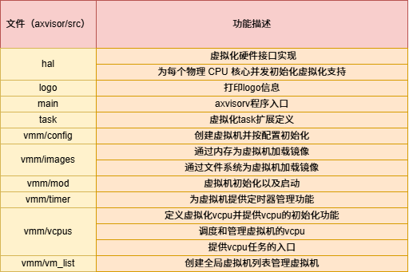

# learninghypervisor-record-from-chen-hong

## axvisor for LA 开发日志

*七月*

* [Day   1    (2020-07-10)](#0) 
* [Day   2    (2020-07-11)](#1) 
* [Day   2    (2020-07-12)](#2) 

### Day 1

​	1.今天主要是阅读axvisor文档除设备相关部分，了解整体的架构。设备相关的内容后面涉及到了再回来补一补。文档里的图画的真好，对我梳理结构有很大帮助。对Axvisor API的后两种不是很理解，可能要具体的看一下\#[impl_interface]、\#[def_interface]等属性到底做了什么。

​	2.阅读axvisor的源代码，主要是根据main函数梳理一下虚拟机的工作流程，目前看了检测硬件支持和使能虚拟化两部分。使能虚拟化部分实现AxVCpuHal trait时使用了关联类型+完全限定的方式，从而实现上层调用不关心底层实现印象深刻。然后明天继续尝试阅读源代码完成对虚拟机工作流的梳理。

### Day 2

今天主要是完成了对axvisor工作流的梳理。整个梳理的过程中遇到比较大的问题是不清楚vmm具体在什么时刻开始执行起来的。这个地方卡了比较久，但是后来想起来hvisor中vcpu经过包装后可以被视作在cpu上运行的task。经此得到启发axvisor实际上是运行在底层arceos上的task,而vmm::init()为每个vmm的主vcpu创建对应的task（入口为vcpu_run）并将该task加入arceos的就绪队列。但是vcpu对应的task第一次运行时会因为对应的vmm未开启导致自身被挂起。而vmm::start()会修改vmm标志位启动vmm，同时将vmm的主vcpu唤醒（将主vcpu对应的task再次调度回arceos的就绪队列）。此时当vmm的vcpu对应的task再次获得时间片运行时，vmm就可以正常运转了。

预计明天从文件的角度整体阅读axvisor代码，然后应该还会开始一些新的学习。

.drawio.png)

### Day3

今天主要是完整的阅读了一下axvisor的代码总结了其中每文件的功能。然后补充了一些关于过程宏的知识。最后请教了苏助教crate发布到crate.io之前需要做哪些工作，苏助教讲解后为我推荐了repo和pr参考，以及可以尝试axvisor--crates中的axaddspace部分。预计明天会学习部分前几期训练营中的Hypervisor，然后阅读助教推荐的repo和pr。

