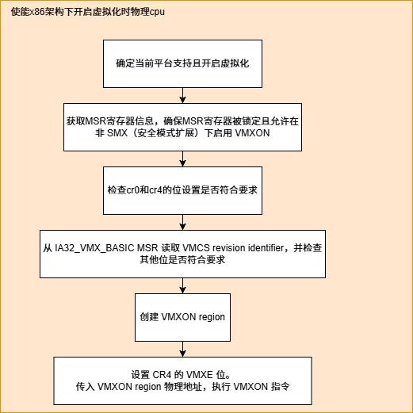
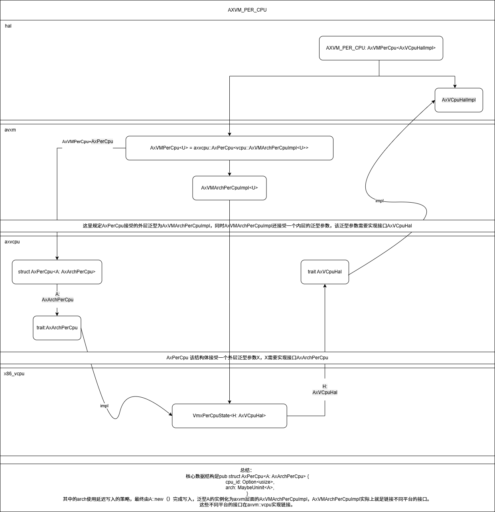
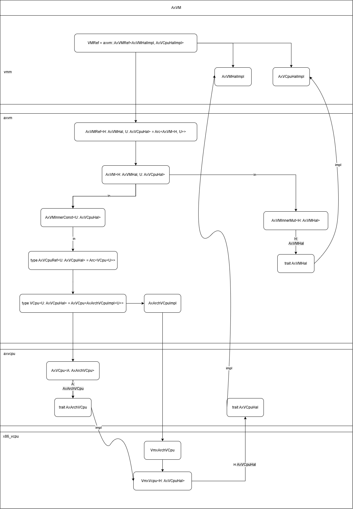

# learninghypervisor-record-from-chen-hong

## axvisor for LA 开发日志

*七月*

* [Day   1    (2025-07-10)](#0) 
* [Day   2    (2025-07-11)](#1) 
* [Day   3    (2025-07-12)](#2) 
* [Day   4    (2025-07-13)](#3)
* [Day   5    (2025-07-15)](#4)
* [Day   6    (2025-07-16)](#5)
* [Day   7    (2025-07-17)](#6)
* [Day   8    (2025-07-18)](#7)
* [Day   9    (2025-07-20)](#8)
* [Day   10    (2025-07-21)](#9)
* [Day   11    (2025-07-22)](#10)
* [Day   12    (2025-07-23)](#11)
* [Day   13    (2025-07-24)](#12)
* [Day   14    (2025-07-25)](#13) 
* [Day   15    (2025-07-26)](#14)   
* [Day   16    (2025-07-27)](#15)
* [Day   17    (2025-07-29)](#16)
* [Day   18    (2025-07-31)](#17)

*八月*
* [Day   19    (2025-08-1)](#18)
* [Day   20  (2025-08-5)](#19)
* [Day   21  (2025-08-6)](#20)
* [Day   22  (2025-08-7)](#21)
* [Day   23  (2025-08-8)](#22)
* [Day   24  (2025-08-10)](#23)
* [Day   25  (2025-08-11)](#24)
* [Day   26  (2025-08-12)](#25)
* [Day   27  (2025-08-11)](#26)
* [Day   28  (2025-08-12)](#27)
* [Day   29  (2025-08-13)](#28)
* [Day   30  (2025-08-14)](#29)
<span id="0"></span>

### Day 1

- 1.今天主要是阅读axvisor文档除设备相关部分，了解整体的架构。设备相关的内容后面涉及到了再回来补一补。文档里的图画的真好，对我梳理结构有很大帮助。对Axvisor API的后两种不是很理解，可能要具体的看一下\#[impl_interface]、\#[def_interface]等属性到底做了什么。

- 2.阅读axvisor的源代码，主要是根据main函数梳理一下虚拟机的工作流程，目前看了检测硬件支持和使能虚拟化两部分。使能虚拟化部分实现AxVCpuHal trait时使用了关联类型+完全限定的方式，从而实现上层调用不关心底层实现印象深刻。然后明天继续尝试阅读源代码完成对虚拟机工作流的梳理。

<span id="1"></span>

### Day 2

- 今天主要是完成了对axvisor工作流的梳理。整个梳理的过程中遇到比较大的问题是不清楚vmm具体在什么时刻开始执行起来的。这个地方卡了比较久，但是后来想起来hvisor中vcpu经过包装后可以被视作在cpu上运行的task。经此得到启发axvisor实际上是运行在底层arceos上的task,而vmm::init()为每个vmm的主vcpu创建对应的task（入口为vcpu_run）并将该task加入arceos的就绪队列。但是vcpu对应的task第一次运行时会因为对应的vmm未开启导致自身被挂起。而vmm::start()会修改vmm标志位启动vmm，同时将vmm的主vcpu唤醒（将主vcpu对应的task再次调度回arceos的就绪队列）。此时当vmm的vcpu对应的task再次获得时间片运行时，vmm就可以正常运转了。

预计明天从文件的角度整体阅读axvisor代码，然后应该还会开始一些新的学习。

.drawio.png)

<span id="2"></span>

### Day3

- 今天主要是完整的阅读了一下axvisor的代码总结了其中每文件的功能。然后补充了一些关于过程宏的知识。最后请教了苏助教crate发布到crate.io之前需要做哪些工作，苏助教讲解后为我推荐了repo和pr参考，以及可以尝试axvisor--crates中的axaddspace部分。预计明天会学习部分前几期训练营中的Hypervisor，然后阅读助教推荐的repo和pr。


<span id="3"></span>

### Day4
今日进度：
- 1.完成了23年秋冬季训练营关于ARMv8的Hypervisor教学视频的学习，主要涉及armv8的寄存器介绍、二阶段地址翻译、及设备虚拟化中断虚拟化等。之后会学习该架构部分对应的实验文档以及完成里面的练习。
- 2.阅读了苏助教推荐axmm_crates源码，学习crate中example以及文档的编写，后续会继续分析该仓库提交的关键pr进一步学习如何完善crate，然后着手完善axaddrspace到可以发布carte.io。
另外明天暂停一天需要回学校答辩。

<span id="4"></span>

### Day5
今日进度：
- 1.阅读分析了axmm_crates仓库的关键pr，其中收获较大的是对MemoryAddr部分的代码重构部分。重构前会确切的定义地址空间结构体，并分别为不同的地址结构体实现大体相同的方法。重构后采用宏来声明定义地址数据结构，在trait中实现地址结构体的通用方法并为通过宏来定义的地质结构体实现，这样使得代码有更好的兼容性和可拓展性。另外axaddrspace中的protect函数好像没有实现明天尝试一下。
- 2.学习了部分AARCH64 Hypercraft教程，预计明天完成该教程学习。

<span id="5"></span>

### Day6

今日进度：
- 1.今天主要看了axaddrspace仓库代码，然后参考axmm中的protect实现补全了axaddrspace中的protect实现。

- 2.看完Hypercraft教程想跑一下对应的实验但是环境一直没搞定，明天求助一下助教。

<span id="6"></span>

### Day7

今天没有什么进展主要是解决了AARCH64 Hypercraft教程实验的环境配置问题把虚拟机跑起来了，然后在做ch2的实验的时候遇到问题，在完成虚拟机的vcpu初始化之前使用info输出信息会导致启动客户机时出现同步异常导致客户机启动失败，暂未确定具体原因是什么。

<span id="7"></span>

### Day8

今日进度：
- 1.初步编写了address_space/mod的测试模块仍需优化修改。

- 2.完成AARCH64 Hypercraft实验ch2和ch3部分。

<span id="8"></span>

### Day9

今日进展不大主要是继续优化address_space/mod模块测试，预计明天提交到之前创建的pr。

<span id="9"></span>

### Day10

今天也是终于将address_space/mod模块测试交到pr里了，后续还要根据review做部分优化以及根据姚礼兴AxMmHal和PagingHandler的通用接口实现对测试代码作出结构调整。

<span id="10"></span>

### Day11

今天主要在参考axcpu和page_table_multiarch实现x86_64架构的flush_tlb函数。但是现在存在问题针对map_line()的测试函数运行在x86架构下时回报错段错误，初步确定时因为调用新实现的flush_tlb导致的。可能是测试里不能直接调用汇编？但是为什么riscv64和aarch可以 >_<

<span id="11"></span>

### Day12

已排查清楚map_line()的测试函数运行在x86架构下时回报错段错误，是因为flush_tlb调用ring0级别指令导致的，而测试不处于ring0，实际上最终问题在于x86_的flush_tlb实现。然后结合x86-64 Hypervisor开始看x86vcpu的设计。

<span id="12"></span>

### Day13

今天主要看了 Intel VMX的初始化以及VMX开起前的物理cpu配置流程。不同平台的物理cpu初始化不一样，所以在适配新的平台时应当从初始化配置切入？在axvisor上适配新的平台至少需要对哪些方面作出调整，物理cpu的配置及初始化+vcpu设计+地址空间设计？



<span id="13"></span>

### Day14

今天主要对address_space/mod 测例适配姚礼兴最终版本AxMmHal和PagingHandler的通用接口，另外针对苏助教之前的review作出修改。

<span id="14"></span>

### Day15

今日主要是做address_space pr的相关收尾工作较为琐碎，然后准备规划一下axvisor for loongarch的开发计划，另外收到新任务跑通最新的arceos for loongarch。

<span id="15"></span>

### Day16

今天正式合并[address_space pr](https://github.com/arceos-hypervisor/axaddrspace/pull/16),然后跑了一下最新的arceos for loongarch64，基本无误。最后就是今天拿到了龙芯架构的虚拟化相关手册开始学习。

<span id="16"></span>

### Day17

今日结合loongarch手册尝试阅读arceos for loongarch代码，但是loongarch方面好像没有什么参考文档ovo需要时间捋一捋。这几天先尽快把arceos for loongarch的整体框架理清楚然后理解相关代码。

对于axvisor for loongarch的开发初步分为三个大的部分:
+ 理解arceos到axvisor启动并打印logo的流程，并为loongarch做出必要适配。（理论上来说在qemu上是否可以跑到axvisor打印logo的部分？这一部分的前置任务是理解arceos for loongarch）
+ 编写loongarch硬件虚拟化使能部分，这一部分应该可以参考hvisor。
+ 编写loonarch vcpu以及对axaddress_space for loongarch做出适配。（完成以上散步能否跑起一个最小guest os ？或者说还要添加虚拟IO、设备等，待验证）

<span id="17"></span>

### Day18

今日主要是对arceos是如和与axvisor链接到一起的有点疑问，如果想跑起来axvisor for LA英爱需要先修改axvisor的make流程调整参数。但是如果需要更换基座arceos需要如何操作目前只看到.toml文件的配置。

<span id="18"></span>

### Day19

今日主要开始学习axplate_crates、axcpu两个仓库代码，主要思路还是从_start启动到axruntime中main函数执行。其中底层的启动与架构相关需要结合loongarch手册一起查看，但是loongarch的一些伪指令信息不太找得到。

<span id="19"></span>

### Day20

今日初步熟悉hvisor for loongarch的源码并与谢助教和姚同学就axvisor for LA做了进一步讨论。
+ CPU检测CPUCFG.2.LVZ[bit10]，确认硬件是否支持虚拟化
+ host模式初始化，配置配置 GTLBC 等寄存器
+ 虚拟机管理模块设计
+ 虚拟机保存的上下文设计
+ 虚拟机加载以及退出
+ cpu虚拟化的部分，补充loongarch vcpu
+ 内存虚拟化，这个都可以参考其他架构的实现，包括两级地址翻译，我看过了，都是两级地址翻译，还有tlb同步，这部部分内容也在axcpu中有提供接口
+ 中断虚拟化（不太熟悉放在后面做）
+ 虚拟io（不太熟悉放在后面做）
 
<span id="20"></span>

### Day21

[arceos for loongarch_start.md](https://github.com/aluojibuzhu/crate-blog/blob/main/arceos%20for%20loongarch_start.md) axvisor arceos启动执行流陆续更新中

[oscomp_arceos_h.md](https://github.com/aluojibuzhu/crate-blog/blob/main/oscomp_arceos_h.md) h系列实验总结陆续更新中

<span id="21"></span>

### Day22

[hvisor for loongarch](https://github.com/aluojibuzhu/crate-blog/blob/main/hvisor.md)
今日主要熟悉hvisor虚拟化工作，另外谢助教初步编写入口处虚拟化使能及二阶段地址翻译代码，对此共同分析讨论中。

**hvisor start 总体流程**：

- 建立虚拟地址空间（DMW0/DMW1）

- 切换到虚拟地址执行（JUMP_VIRT_ADDR）

- 配置 CPU 运行状态（CRMD/PRMD/EUEN）

- 设置多核独立栈（per-CPU stack）

- 确保内存一致性（内存屏障）

- 进入 Rust 代码（[rust_main]main.rs )）

<span id="22"></span>

### Day23
h系列实验
- **_run_guest**：ctx作为run_guest的第一个函数，ctx的地址被传入a0寄存器

  - 保存h模式通用寄存器

    ```asm
        /* Save hypervisor state */
    
        /* Save hypervisor GPRs (except T0-T6 and a0, which is GuestInfo and stashed in sscratch) */
        sd   ra, ({hyp_ra})(a0)
        sd   gp, ({hyp_gp})(a0)
        sd   tp, ({hyp_tp})(a0)
        sd   s0, ({hyp_s0})(a0)
        sd   s1, ({hyp_s1})(a0)
        sd   a1, ({hyp_a1})(a0)
        sd   a2, ({hyp_a2})(a0)
        sd   a3, ({hyp_a3})(a0)
        sd   a4, ({hyp_a4})(a0)
        sd   a5, ({hyp_a5})(a0)
        sd   a6, ({hyp_a6})(a0)
        sd   a7, ({hyp_a7})(a0)
        sd   s2, ({hyp_s2})(a0)
        sd   s3, ({hyp_s3})(a0)
        sd   s4, ({hyp_s4})(a0)
        sd   s5, ({hyp_s5})(a0)
        sd   s6, ({hyp_s6})(a0)
        sd   s7, ({hyp_s7})(a0)
        sd   s8, ({hyp_s8})(a0)
        sd   s9, ({hyp_s9})(a0)
        sd   s10, ({hyp_s10})(a0)
        sd   s11, ({hyp_s11})(a0)
        sd   sp, ({hyp_sp})(a0)
    ```

  - 保存hyp_sstatus加载guest_sstatus（上文准备的ctx），同时写入guest_hstatus之后调用指令sret时就返回vs

    ```rust
        ld    t1, ({guest_hstatus})(a0)
        csrrw t1, hstatus, t1
    ```

  - 加载客户机对应的scounteren，**`scounteren`寄存器**（Supervisor Counter Enable Register）是一个与性能计数器访问权限相关的寄存器，主要用于控制用户模式（U-mode）对硬件性能计数器的访问权限。

  - 设置sepc，加载Guest入口
  - stvec切换到Guest模式下异常向量基址
  - 保存宿主机状态加载虚拟机GuestInfo
  - 客户机通用寄存器加载
  - sret返回到guest模式入口为sepc的值

- **_guest_exit**：基本相同就不多赘述，需注意ret返回时通过ra寄存器。

<span id="23"></span>

### Day24

有点累下次再说一下这些是啥
[拆分表格](https://github.com/aluojibuzhu/crate-blog/blob/main/%E6%8B%86%E5%88%86%E8%A1%A8%E6%A0%BC.md)



<span id="24"></span>

### Day25

明天拉完小会再再解释以下
[vcpu仓库总结](https://github.com/LearningOS/learning-hypervisor-record-from-chen-hong/blob/main/photo_gallery/vcpu%E4%BB%93%E5%BA%93%E6%80%BB%E7%BB%93.png)

<span id="25"></span>

### Day26

axvisor for LA主要的任务是实现axvm/src/vcpu中的预留的接口。这些接口是实现在对应的vcpu仓库，其中主要编写的文件为percpu、vcpu两个文件，来个文件分别对应pecpu、vcpu的数据结构设计实现，以及这两个数据结构都有需要对应实现的trait。
所以目前得计划是：
+ 设计实现precou、vcpu数据结构
+ 为percpu、vcpu实现必要的trait
+ 为percpu、vcpu编写加载和退出处理函数
+ 为percpu、vcpu编写特殊架构下的必要方法
+ 以及编写二阶段地址翻译部分

<span id="26"></span>

### Day27
学习oscomp中u系列实验

<span id="27"></span>

### Day28
在vcpu初步设计完成后开始学习编写axvisor for LA的vcpu加载退出代码

<span id="28"></span>

### Day29

看谢助教初步提交的loongarchvcpu仓库代码，但是基础的代码架构还没有设计好暂时先不动。

<span id="29"></span>

### Day30

开始写run_guest的demo
